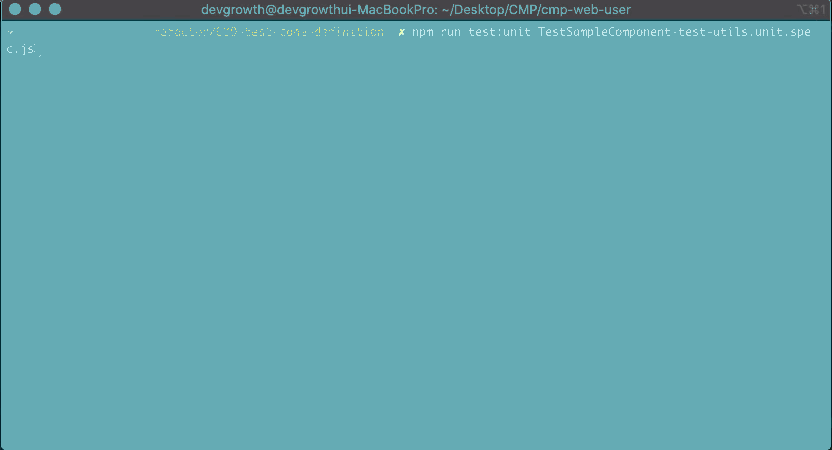

- [Jest 기본 사용법](#jest-기본-사용법)
  - [Test 파일 구성](#test-파일-구성)
  - [Test File 이름 짓기](#test-file-이름-짓기)
  - [Jest 코드 작성](#jest-코드-작성)
    - [Jest 로 스냅샷 테스트하기](#jest-로-스냅샷-테스트하기)
- [Vue Component Test](#vue-component-test)
- [Vue Test Util](#vue-test-util)
  - [Test Util 사용법](#test-util-사용법)
  - [자주 사용하는 API](#자주-사용하는-api)

# Jest 기본 사용법

Spharos CMP 프로젝트의 Jest 는 `package.json` dependencies 내부에 `@vue-plugin-e2e-cypress` 로 정의되어있으며, 하단 스크립트로 실행 할 수 있습니다.
~~*`--mode` 는, 개발기 `dev`, 배포용 `prod` 으로 변경할 수 있습니다.*~~

``` json
    "scripts": {
      "test:unit": "vue-cli-service test:unit --mode prod"
    },
    "devDependencies": {
        "@vue/cli-plugin-unit-jest": "version..."
    }
```

``` bash
    $ npm run test:unit <Test File Name>
```

## Test 파일 구성

모든 테스트 코드를 깔끔하게 `/tests` 디렉터리에 집어넣는 방법을 주로 사용하며, 작성된 테스트 코드의 종류(단위 테스트 / 통합 테스트)를 고려해야합니다. 현재 CMP 프로젝트의 `/tests` 파일 구성은 아래와 같습니다.

``` bash
    ㄴ tests 
      ㄴ e2e # e2e 테스트 파일이 포함됩니다
      ㄴ unit # 단위 테스트 파일이 포함됩니다
      ㄴ integration # 통합 테스트 파일이 포함됩니다
```

## Test File 이름 짓기

테스트 종류에 상관없이 `*.test.js` 는 명확하게 이해할 수 없으므로, 테스트 종류를 파일 이름 앞에 포함시킵니다.

* 단위 테스트 : `index.unit.test.js`
* 통합 테스트 : `api.int.test.js`


## Jest 코드 작성

Jest는 스냅샷 테스트 ([Snapshot test](https://jestjs.io/docs/snapshot-testing)) 이라는 기능도 갖고있습니다.

스냅샷 테스트는 **UI가 의도치않게 변경되지 않도록 상태를 유지하고싶을 때 사용**합니다. 

전형적인 스냅샷 테스트는 UI 컴포넌트를 랜더링해서, 스냅샷을 찍은 후, 스냅샷 파일을 저장된 테스트 파일과 비교합니다.
테스트는 두개의 스냅샷을 비교해서 일치하지 않을 경우(변화가 예상되지 않거나, 참조할 스냅샷이 새로운 버전의 UI 컴포넌트가 필요한 경우 둘중 하나) 실패합니다.

### Jest 로 스냅샷 테스트하기

[문서](https://jestjs.io/docs/snapshot-testing)


# Vue Component Test 

Vue 공식 문서에 정의되어있는 [Vue 컴포넌트를 위한 단위 테스트](https://kr.vuejs.org/v2/guide/unit-testing.html) 도 가능합니다.


``` html
  <!-- TestSampleComponent.vue -->
  <template>
    <div>
      {{ message }}
    </div>
  </template>

  <script>
  export default {
    name: 'TestSampleComponent',
    created () {
      this.message = 'created!'
    },
    data () {
      return {
        message: 'default message!'
      }
    }
  }
  </script>
```

``` js
  // TestSampleComponent.unit.spec.jsimport Vue from 'vue'
  import component from '@/views/TestSampleComponent.vue'
  // TestSampleComponent 컴포넌트 이름이 너무 길기 때문에 component 로 축약합니다.

  describe('TestSampleComponent Test', () => {
    it('컴포넌트의 data property 타입 은 \'fundtion\' 인가요?', () => {
      // console.log('==== created()/data() 의 타입은? ', typeof component.created, typeof component.data)
      expect(typeof component.created).toBe('function')
      expect(typeof component.data).toBe('function')
    })

    test('data() 함수 결과를 테스트합니다.', () => {
      const defaultData = component.data()
      // console.log(defaultData) // data() 메서드내부에 정의된 모든 프로퍼티를 Object 형태로 반환합니다.
      expect(defaultData.message).toBe('default message!')
    })

    it('Mount 할 때 컴포넌트의 data() 내부 데이터를 테스트합니다.', () => {
      const vm = new Vue(component)
      // console.log('data() 의 message 프로퍼티의 값은?', vm.message)
      expect(vm.message).toBe('created!')
    })
  })
```


# Vue Test Util

Vue Test Utils(VTU) 은 간단하게 Vue.js 컴포넌트를 테스트해볼 수 있는 utility function 입니다. Vue 컴포넌트들을 독립된 방법으로 테스트할 수 있도록 도와줍니다. 관련 [API 문서](https://vue-test-utils.vuejs.org/api/#shallowmount)를 참고하세요.

## Test Util 사용법

Vue Test Util 은 Spharos CMP 프로젝트 dependencies 내부에 `@vue/test-utils` 로 정의되어있으며,  테스트 파일에 `import` 하여 사용할 수 있습니다.

``` json
    "devDependencies": {
        "@vue/test-utils": "version..."
    }
```

기본 작성법은 [공식문서](https://vue-test-utils.vuejs.org/guides/#getting-started)를 참조하세요.


## 자주 사용하는 API

Vue Test Utils 는 [`Wrapper`](https://vue-test-utils.vuejs.org/api/wrapper/#wrapper) 로 구성되어 있습니다. 

`Wrapper` 는 컴포넌트나 vnode 를 테스트하기 위한 mounted 된 컴포넌트나 vnode 와 메서드를 포함하는 `object` 입니다.

컴포넌트의 간단한 테스트 방법은 아래와 같습니다. 

``` html
<!-- TestSampleComponent.vue -->
<template>
  <div>
    <button @click="clickEvent">
      메롱
    </button>

    <input type="text">
  </div>
</template>

<script>
export default {
  name: 'TestSampleComponent',
  props: {
    kitty: {
      type: String,
      default: '🐱'
    }
  },
  methods: {
    clickEvent () {
      console.log('클릭클릭했어!')
    }
  },
  // ...
}
</script>
```

``` js
  import { mount } from '@vue/test-utils'
  import component from './TestSampleComponent.vue'

  describe('test-util 테스트입니다.', () => {
    test('wrapper 와 element 체크하기!', async () => {
      // const spy = sinon.spy()
      const wrapper = mount(component)

      // 요소 확인하기
      const button = wrapper.find('button')
      expect(button.exists()).toBe(true) // wrapper가 존재하는지 확인합니다.
      expect(button.text()).toBe('메롱') // 컨텐츠의 text 를 반환합니다.
      expect(button.text()).toContain('메롱')
    })
  })
```

설정된 props 를 확인할 수도 있습니다.

``` js
  test('props 확인하기 및 기타 작업 해보기!', async () => {
    const wrapper = mount(component, {
      propsData: { // component 의 props 데이터
        kitty: '고양이는 귀여워' // 해당 props 를 주석처리하면 default 데이터 (🐱) 가 표시됩니다
      }
    })

    // props 확인하기
    expect(wrapper.props().kitty).toBe('고양이는 귀여워')
    expect(wrapper.props('kitty')).toBe('고양이는 귀여워')

    // event 발생시키기
    const button = wrapper.find('button')
    button.trigger('click')  // '클릭클릭했어!' 가 표시됩니다.
    button.trigger('keydown.up')

    // value 설정하기
    const input = wrapper.find('input')
    await input.setValue('text value 설정...')
    // console.log(input.element)

    expect(input.element.value).toBe('text value 설정...')
  })
```



그 외 자세한 다른 API 는 [문서](https://vue-test-utils.vuejs.org/api/#mount)를 참고하세요.


-----------------
출처
> * Jest 파일 구성 - [Organizing Tests in Jest](https://medium.com/@JeffLombardJr/organizing-tests-in-jest-17fc431ff850)
> * Vue Test Utils - [Vue Test Utils](https://vue-test-utils.vuejs.org/api)

